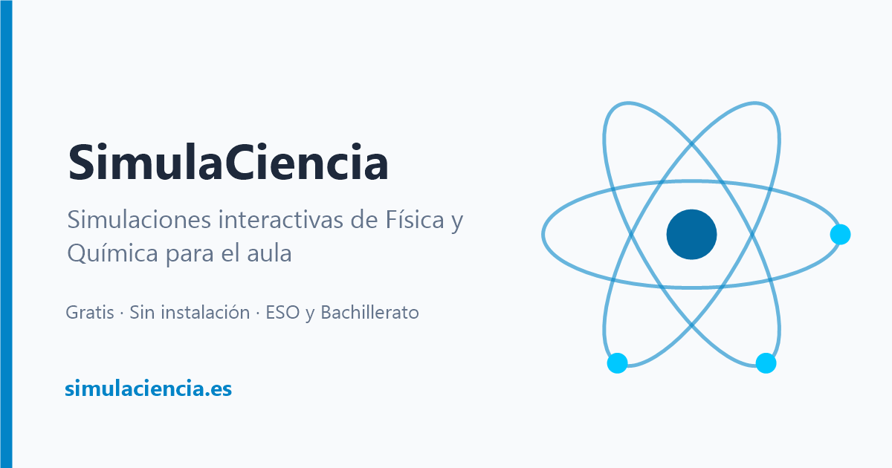

# SimulaCiencia

**Simulaciones interactivas de Física y Química para el aula** · [simulaciencia.es](https://simulaciencia.es)



SimulaCiencia es un catálogo de simulaciones gratuitas para ESO y Bachillerato. Se abren en el
navegador, en el ordenador del aula, en la pizarra digital o en el móvil, sin instalar nada ni
crear una cuenta. Están pensadas para que el alumnado pueda «ver» y manipular lo que ocurre a
escala microscópica o lo que no se puede reproducir en el laboratorio.

Las crea Juanra, profesor de Física y Química en la Comunidad de Madrid. Puedes leer cómo nació el
proyecto en [Sobre el proyecto](https://simulaciencia.es/sobre-el-proyecto/).

## Simulaciones

| Simulación | Materia | Nivel | Qué trabaja |
|---|---|---|---|
| [Principio de Arquímedes](https://simulaciencia.es/simulaciones/arquimedes/) | Física | ESO, Bachillerato | Flotabilidad y empuje: cuándo un cuerpo flota, se hunde o queda en equilibrio. |
| [Densidad](https://simulaciencia.es/simulaciones/densidad/) | Física, Química | ESO | Relación entre masa, volumen y densidad con distintos materiales y líquidos. |
| [Cambios de Estado](https://simulaciencia.es/simulaciones/cambios-estado/) | Física, Química | ESO | Recipiente, partículas y curva de calentamiento a la vez, con diagrama de fases. |
| [Enlaces Químicos](https://simulaciencia.es/simulaciones/enlaces-quimicos/) | Química | ESO, Bachillerato | Enlace iónico, covalente y metálico sobre el modelo de Bohr. |
| [Modelos Atómicos](https://simulaciencia.es/simulaciones/modelos/) | Física, Química | Bachillerato | Dispersión de Rutherford frente al modelo de Thomson. |
| [El Átomo a Escala](https://simulaciencia.es/simulaciones/atomo-real/) | Física, Química | Bachillerato | Zoom desde el átomo completo hasta su núcleo, a escala real. |
| [Espectros Atómicos](https://simulaciencia.es/simulaciones/espectros/) | Química | Bachillerato | Espectros de emisión y absorción y transiciones electrónicas. |
| [Cinética de Gases](https://simulaciencia.es/simulaciones/gases/) | Física | Bachillerato | Presión, temperatura y volumen con la teoría cinético-molecular. |
| [Velocidad de Reacción](https://simulaciencia.es/simulaciones/velocidad-reaccion/) | Química | Bachillerato | Efecto de la temperatura, la concentración y el catalizador. |
| [Órbitas y Gravitación](https://simulaciencia.es/simulaciones/orbitas/) | Física | Bachillerato | Bala de cañón de Newton, Sistema Solar, leyes de Kepler y estrellas binarias. |

## Cómo usarlas en clase

- **Enlace directo:** cada simulación tiene su propia dirección (por ejemplo,
  `https://simulaciencia.es/simulaciones/densidad/`) para pegarla en Classroom, Moodle o Teams.
- **Insertarla en tu aula virtual:** el botón *Compartir* de cada simulación da el código
  `<iframe>` listo para pegar.
- **Pantalla completa** para proyectar, y una versión imprimible con `Ctrl + P`.
- **Guía docente:** cada simulación tiene la suya, con los cursos y saberes básicos que trabaja,
  una secuencia para explicarla en clase, las concepciones alternativas que ayuda a corregir y
  sus simplificaciones. Se lee en la web (por ejemplo,
  `https://simulaciencia.es/guias/densidad/`) o se descarga en PDF, Word o LibreOffice.

Las simulaciones simplifican la física para que se entienda lo importante. No sustituyen al
laboratorio ni pretenden ser software de precisión científica.

## Sugerencias y errores

Escribe a **contacto@simulaciencia.es** o abre una
[incidencia en GitHub](https://github.com/jrgrijota/simulaciencia/issues). Las ideas para nuevas
simulaciones son bienvenidas.

## Licencia

© 2026 Juan Ramón Grijota.

- Código: [MIT](LICENSE).
- Contenido educativo (textos, explicaciones, imágenes y diseño didáctico):
  [CC BY-SA 4.0](LICENSE-CONTENT.md).

Puedes usar, adaptar y compartir este material citando la autoría.

---

## Para desarrolladores

Este repositorio es el portal: una SPA hecha con Vite, Tailwind CSS 4 y JavaScript sin framework.
Cada simulación vive en su propio repositorio (`simulacion-*`), se publica por separado en GitHub
Pages y el portal la carga en un `<iframe>`.

```bash
npm install
npm run dev      # servidor de desarrollo
npm run build    # genera dist/ (páginas pregeneradas, sitemap.xml y descargas de las guías)
```

Para pregenerar las páginas y generar las descargas de las guías en local hacen falta Chrome (o Edge) y
[Pandoc](https://pandoc.org) 3.12.1. Si no se encuentran, el build avisa y se salta esos formatos;
sus rutas se pueden indicar con `CHROME_PATH` y `PANDOC_PATH`.

- **Catálogo:** [`src/data/simulations.js`](src/data/simulations.js) es la única fuente de verdad.
  Para añadir una simulación basta con añadir una entrada; el sitemap se regenera solo.
- **Guías docentes:** cada archivo `guias/<nombre>.md` es la guía de la simulación `sim-<nombre>`.
  Al añadir o sustituir uno, el build crea su página, el botón «Guía docente», la entrada del
  sitemap y las descargas (`scripts/build-guides.mjs`). Los enlaces a `jrgrijota.github.io` se
  reescriben solos a simulaciencia.es.
- **Rutas:** `/simulaciones/<nombre>/` abre una simulación, `/guias/<nombre>/` su guía docente,
  y `/sobre-el-proyecto/` y `/aviso-legal/` las páginas fijas ([`src/paths.js`](src/paths.js)).
  Los enlaces antiguos (`?sim=`, `?guia=`, `?page=`) redirigen a la dirección nueva.
- **Páginas pregeneradas:** tras el build, `scripts/prerender.mjs` abre cada ruta en Chrome sin
  interfaz y guarda su HTML en `dist/<ruta>/index.html`, para que buscadores y vistas previas al
  compartir vean el contenido sin ejecutar JavaScript. Sin Chrome, cada ruta recibe una copia de
  `index.html`.
- **Despliegue:** cada push a `main` publica la web en simulaciencia.es mediante GitHub Actions.
